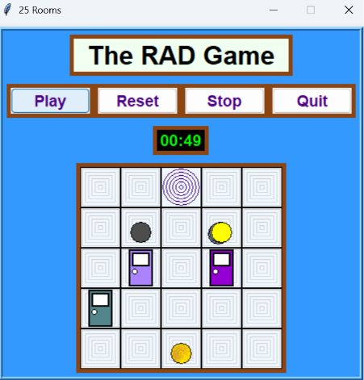

# RAD Game

A desktop memory game built around random graph traversal, with a from-scratch Python game engine, a custom Tkinter GUI, and graph algorithms designed to make the maze as hard as possible for a random walker to solve.

🌐 **[Play the web version](https://avikpln.github.io/rad/)** — a JavaScript port with enhanced visuals (see [Origins](#origins) below)



---

## The Game

You start in the first room of a randomly generated maze. Your goal: navigate through doors to find the final golden door, collecting one stone per level along the way — the final door won't open without all of them. Use the arrow keys to move, Enter to open a door, Backspace to undo, and Space to mark a cell.

You're racing against **Randy** — or several of them. Each Randy is a true random walker: at every step, he picks a random adjacent room and moves toward it, with no knowledge of the maze beyond what's directly reachable. Multiple Randys can compete simultaneously, each running an independent random walk over the same graph.

---

## Algorithmic Design

The core design question behind this project was: **what graph structure makes a random walk take the longest to reach the exit?**

This is implemented through two pieces of graph theory:

1. **Random tree generation** (`graph.get_random_tree`) — a uniformly random spanning tree is generated using a randomized version of **Kruskal's algorithm**: edges are shuffled, then added one at a time via union-find as long as they don't form a cycle. The result is a maze with no loops, where a random walker can easily wander into dead-end branches far from the goal.

2. **Diameter-based entry/exit selection** (`graph.find_tree_diameter_endpoints`) — rather than picking the start and end rooms arbitrarily, the two endpoints of the tree's **diameter** (its longest path) are found using two breadth-first searches. This maximizes the graph-distance a walker must cover, directly increasing the expected number of steps a random walk needs to reach the exit.

A custom **union-find / weighted quick-union with path compression** (`unionfind.py`) data structure backs the spanning tree construction, implemented from scratch rather than using a library.

---

## Architecture

The codebase is split into a headless game engine and a presentation layer, connected through a clean interface:

- **`radgame.py`** — the core engine: `Room`, `Door`, `Cell`, `Walker` (with `Player` and `Randy` subclasses), `Network`, and `Game`, modeled as a state machine. No UI dependencies — this module could drive any front end.
- **`radgamegui.py`** — a Tkinter GUI built on top of the engine: custom canvas rendering (`Displayer`), a style/theming system, a timer, keyboard bindings, and animated random walkers.
- **`graph.py`** / **`unionfind.py`** — the graph algorithms and supporting data structure described above.
- **`library.py`** — color palette (X11 colors) and a quote bank shown on victory, preprocessed from the raw data in [`db/`](db).

Class structure and method signatures were also captured as standalone skeleton modules (see [`design/`](design)) and used to generate UML class diagrams during development.

---

## Origins

This is the original implementation of the game, written in Python with a Tkinter GUI and packaged as a standalone Windows executable. It was later reimagined as a browser-based game in HTML, CSS, and JavaScript — [Rooms & Doors](https://github.com/avikpln/rad) — with significant enhancements to graphics and interactivity, while keeping the same underlying graph algorithms.

---

## Running Locally

**Run from source:**

```bash
git clone https://github.com/avikpln/radgame.git
cd radgame/src
python radgamegui.py
```

Requires Python 3 with Tkinter (included in most standard installations).

**Build a standalone Windows executable:**

```bash
pip install pyinstaller
Build.bat
```

This produces `dist/radgame.exe`.

---

## Project Structure

```
radgame/
├── src/                  # Source code
│   ├── radgame.py        # Core game engine
│   ├── radgamegui.py     # Tkinter GUI
│   ├── graph.py          # Graph algorithms
│   ├── unionfind.py      # Union-find data structure
│   ├── library.py        # Colors and quotes
│   └── radgame.ico       # App icon
├── design/               # UML class skeletons, screenshots, design assets
├── db/                   # Original raw data (colors, quotes), later
│                         # preprocessed and inlined into library.py
├── Build.bat             # Builds the Windows executable
└── README.md
```

---

## Acknowledgements

Thanks to David Naori for ideas that shaped the game: door coloring and the countdown timer.
